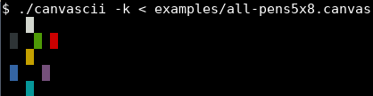

# TP1: Dessiner sur un canevas ASCII

  
## Description

Ce projet a été développé dans le cadre du cours **Construction et Maintenance de Logiciels** (INF3135), enseigné par Serge Dogny à l'Université du Québec à Montréal. L'objectif est de fournir aux utilisateurs un moyen de réaliser des dessins sur un canevas ASCII, tout en utilisant des options spécifiques pour la gestion des entrées via l'entrée standard. Le programme, écrit en C et nommé `canvascii.c`, permet de créer un canevas qui peut être initialisé ou chargé via l'entrée standard (stdin). Les résultats sont ensuite affichés sur la sortie standard (stdout).

Un canevas est défini comme un fichier texte composé de `h` lignes, chacune ayant une largeur de `w` caractères. Les caractères utilisés pour représenter différents états ou couleurs de pixels sont les suivants:

- Le caractère `.` représente un pixel non occupé.
- Les chiffres `0` à `7` sont utilisés pour indiquer différentes couleurs selon les codes de couleur ANSI:
  - `0`: Noir
  - `1`: Rouge
  - `2`: Vert
  - `3`: Jaune
  - `4`: Bleu
  - `5`: Magenta
  - `6`: Cyan
  - `7`: Blanc

Ci-dessous, un exemple de canevas valide avec `h = 5`, `w = 8`, utilisant les 7 couleurs mentionnées:

```
...7....
.0..2.1.
...3....
.4...5..
...6....
```

### Options supportées
--------------
Les options supportées sont `-n`, `-s`, `-h`, `-v`, `-r`, `-l`, `-c`, `-p` et `-k`.

Lorsque le programme est exécuté sans arguments, le manuel d'utilisation s'affiche automatiquement sur la sortie standard.

```text
$ ./canvascii
Usage: ./canvascii [-n HEIGHT,WIDTH] [-s] [-k] [-p CHAR]
          [-h ROW] [-v COL] [-r ROW,COL,HEIGHT,WIDTH]
          [-l ROW1,COL1,ROW2,COL2] [-c ROW,COL,RADIUS]
Draws on an ASCII canvas. The canvas is provided on stdin and
the result is printed on stdout. The dimensions of the canvas
are limited to at most 40 rows and at most 80 columns.

If no argument is provided, the program prints this help and exit.

Canvas options:
  -n HEIGHT,WIDTH           Creates a new empty canvas of HEIGHT rows and
                            WIDTH columns. Should be used as first option,
                            otherwise, the behavior is undefined.
                            Ignores stdin.
  -s                        Shows the canvas and exit.
  -k                        Enables colored output. Replaces characters
                            between 0 and 9 by their corresponding ANSI
                            colors:
                              0: black  1: red      2: green  3: yellow
                              4: blue   5: magenta  6: cyan   7: white

Drawing options:
  -p CHAR                   Sets the pen to CHAR. Allowed pens are
                            0, 1, 2, 3, 4, 5, 6 or 7. Default pen
                            is 7.
  -h ROW                    Draws an horizontal line on row ROW.
  -v COL                    Draws a vertical line on column COL.
  -r ROW,COL,HEIGHT,WIDTH   Draws a rectangle of dimension HEIGHTxWIDTH
                            with top left corner at (ROW,COL).
  -l ROW1,COL1,ROW2,COL2    Draws a discrete segment from (ROW1,COL1) to
                            (ROW2,COL2) with Bresenham's algorithm.
  -c ROW,COL,RADIUS         Draws a circle centered at (ROW,COL) of
                            radius RADIUS with the midpoint algorithm.
```

#### Option `-n`: création d'un canevas

Cette fonctionnalité crée un canevas où tous les pixels sont vides, chaque pixel vide étant représenté par le caractère `.`. Les dimensions maximales du canevas sont fixées à `40,80`, soit une hauteur de 40 et une largeur de 80. Toute valeur dépassant ces limites ou étant négative n'est pas acceptée et provoquera une erreur. Il est d'autant plus important de respecté le format vous étant imposé par le manuel d'utilisation, soit `-n HAUTEUR,LARGEUR`.

Voici un exemple d'utilisation : 

```sh
$ ./canvascii -n 2,4
....
....
```

En cas d'erreur liée aux dimensions, voici les messages d'erreurs auxquels vous ferez face;

Si la hauteur de votre canevas dépasse la limite autorisée : 

```sh
$ ./canvascii -n 50,20
Error: canvas is too high (max height: 40)
Usage: ./canvascii [-n HEIGHT,WIDTH] [-s] [-k] [-p CHAR]
          [-h ROW] [-v COL] [-r ROW,COL,HEIGHT,WIDTH]
          [-l ROW1,COL1,ROW2,COL2] [-c ROW,COL,RADIUS]
[...]
```

Si la largeur de votre canevas dépasse la limite autorisée :

```sh
$ ./canvascii -n 20,90
Error: canvas is too wide (max width: 80)
Usage: ./canvascii [-n HEIGHT,WIDTH] [-s] [-k] [-p CHAR]
 [-h ROW] [-v COL] [-r ROW,COL,HEIGHT,WIDTH]
 [-l ROW1,COL1,ROW2,COL2] [-c ROW,COL,RADIUS]
[...]
```

Si vous omettez un paramètre de l'option `n` :
```sh
$ ./canvascii -n
Error: missing value with option -n
Usage: ./canvascii [-n HEIGHT,WIDTH] [-s] [-k] [-p CHAR]
          [-h ROW] [-v COL] [-r ROW,COL,HEIGHT,WIDTH]
          [-l ROW1,COL1,ROW2,COL2] [-c ROW,COL,RADIUS]
[...]
```

Si une valeur invalide est spécifiée pour l'option `n`:
```sh
$ ./canvascii -n -5,5
Error: incorrect value with option -n
Usage: ./canvascii [-n HEIGHT,WIDTH] [-s] [-k] [-p CHAR]
          [-h ROW] [-v COL] [-r ROW,COL,HEIGHT,WIDTH]
          [-l ROW1,COL1,ROW2,COL2] [-c ROW,COL,RADIUS]
[...]
```
#### Option `-s`: affichage du canevas

L'utilisation de l'option `-s` entraîne l'affichage du canevas sur la sortie standard et termine ensuite l'exécution du programme. Cette option doit être utilisée seule ; toute option spécifiée après elle sera ignorée. 

```sh
$ ./canvascii -s < examples/empty5x8.canvas
........
........
........
........
........
```

Pour l'option `s`, il est impératif de respecter les conditions de dimensions et de format [précédemment établies](#option-n-création-dun-canevas). Assurez-vous également d'utiliser les caractères appropriés : `.` pour un pixel vide et les couleurs de `0` à `7`. En cas de non-conformité, le programme affichera un message d'erreur et se terminera.

```sh
$ ./canvascii -s < examples/wrong-char.canvas
Error: wrong pixel value #
Usage: ./canvascii [-n HEIGHT,WIDTH] [-s] [-k] [-p CHAR]
          [-h ROW] [-v COL] [-r ROW,COL,HEIGHT,WIDTH]
          [-l ROW1,COL1,ROW2,COL2] [-c ROW,COL,RADIUS]
[...]
```
#### Option `-h`: tracé d'une ligne horizontale

L'option `-h` permet de tracer une ligne horizontale occupant la largeur de tout le canevas.
```sh
$ ./canvascii -n 3,7 -h 1
.......
7777777
.......
```

Si le numéro de ligne spécifié est en dehors des limites du canevas, un message d'erreur sera affiché et le manuel d'utilisation sera rappelé.

```sh
$ ./canvascii -n 3,5 -h 6
Error: incorrect value with option -h
Usage: ./canvascii [-n HEIGHT,WIDTH] [-s] [-k] [-p CHAR]
          [-h ROW] [-v COL] [-r ROW,COL,HEIGHT,WIDTH]
          [-l ROW1,COL1,ROW2,COL2] [-c ROW,COL,RADIUS]
[...]
```

#### Option `-v`: tracé d'une ligne verticale

L'option `-v` permet de dessiner une ligne verticale qui s'étend sur toute la hauteur du canevas.

```sh
$ ./canvascii -n 3,7 -v 1 -v 3 -v 5
.7.7.7.
.7.7.7.
.7.7.7.
```

Si le numéro de colonne spécifié est en dehors des limites du canevas, un message d'erreur sera affiché et le manuel d'utilisation sera rappelé.

```sh
$ ./canvascii -n 3,5 -v 5
Error: incorrect value with option -v
Usage: ./canvascii [-n HEIGHT,WIDTH] [-s] [-k] [-p CHAR]
          [-h ROW] [-v COL] [-r ROW,COL,HEIGHT,WIDTH]
          [-l ROW1,COL1,ROW2,COL2] [-c ROW,COL,RADIUS]
[...]
```

#### Option `-r`: tracé d'un segment

L'option `-r` permet de tracer un rectangle sur le canevas:

```sh
$ ./canvascii -n 5,7 -r 1,1,3,5
.......
.77777.
.7...7.
.77777.
.......
```

Les positions peuvent être négatives, comme illustré ci-dessous :
```sh
$ ./canvascii -n 5,5 -r -1,-1,3,3
.7...
77...
.....
.....
.....
```

Cependant, les dimensions ne peuvent pas être négatives. Si elles le sont, un message d'erreur sera affiché et le programme se terminera.

```sh
$ ./canvascii -n 5,5 -r 1,1,-2,-2
Error: incorrect value with option -r
Usage: ./canvascii [-n HEIGHT,WIDTH] [-s] [-k] [-p CHAR]
          [-h ROW] [-v COL] [-r ROW,COL,HEIGHT,WIDTH]
          [-l ROW1,COL1,ROW2,COL2] [-c ROW,COL,RADIUS]
[...]
```

#### Option `-l`: tracé d'un segment

L'option `-l` utilise l'algorithme de Bresenham pour tracer un segment discret.

```sh
$ ./canvascii -n 6,13 -l 1,1,4,11
.............
.77..........
...777.......
......7777...
..........77.
.............
```

Voici divers mode d'utilisation:

Points du segments rognés lorsqu'ils se trouvent hors canevas :

```sh
$ ./canvascii -n 4,10 -l 1,1,4,11
..........
.77.......
...777....
......7777
```

Un segment possédant des coordonnées négatives :

```sh
$ ./canvascii -n 5,5 -l -2,6,6,-2
....7
...7.
..7..
.7...
7....
```
#### Option  `-c`: tracé d'un cercle

L'option `-c` permet de tracer un cercle discret.

```sh
$ ./canvascii -n 11,11 -c 5,5,5
...77777...
..7.....7..
.7.......7.
7.........7
7.........7
7.........7
7.........7
7.........7
.7.......7.
..7.....7..
...77777...
```

Le centre du cercle peut avoir des coordonnées négatives:

```sh
$ ./canvascii -n 5,5 -c -1,-1,5
....7
....7
...7.
..7..
77...
```

Cependant, si le rayon du cercle est négatif, un message d'erreur sera affiché et le programme se terminera.

```sh
$ ./canvascii -n 5,5 -c 1,1,-2
Error: incorrect value with option -c
Usage: ./canvascii [-n HEIGHT,WIDTH] [-s] [-k] [-p CHAR]
          [-h ROW] [-v COL] [-r ROW,COL,HEIGHT,WIDTH]
          [-l ROW1,COL1,ROW2,COL2] [-c ROW,COL,RADIUS]
[...]
```

#### Option `-p`: sélection du crayon
À tout moment, il est possible de changer le crayon utilisé pour dessiner :

```sh
$ ./canvascii -n 5,5 -p 4 -h 2 -p 2 -v 2
..2..
..2..
44244
..2..
..2..
```

Par défaut, le crayon utilisé est `7`.

#### Option `-k`: colorisation du canevas

Enfin, pour obtenir une sortie en couleur, les caractères de `0` à `7` peuvent être convertis en utilisant leurs [code de couleur ANSI](https://en.wikipedia.org/wiki/ANSI_escape_code#3/4_bit) correspondants.

```sh
$ ./canvascii -k < examples/all-pens5x8.canvas
```


Si une option non reconnue est utilisée, un message d'erreur sera affiché et le programme se terminera.

```sh
$ ./canvascii -n 5,5 -a
Error: unrecognized option -a
Usage: ./canvascii [-n HEIGHT,WIDTH] [-s] [-k] [-p CHAR]
          [-h ROW] [-v COL] [-r ROW,COL,HEIGHT,WIDTH]
          [-l ROW1,COL1,ROW2,COL2] [-c ROW,COL,RADIUS]
[...]
```
 
Pour plus d'informations sur le projet, consultez le [sujet du travail](sujet.md).
  

## Auteur

  Églantine Clervil (CLEE89530109)
  
## Fonctionnement

### 1. Compilation du projet

La compilation est le processus de transformation du code source écrit en C en un programme exécutable. Pour compiler ce projet, tu as besoin d'utiliser une commande dans ton terminal qui va appeler le  `Makefile`  pour automatiser cette tâche.

-   **Ouvrez un terminal**  sur votre ordinateur.
    
-   **Naviguez jusqu'au dossier**  contenant les fichiers du projet, incluant le  `Makefile`  et le fichier source  `canvascii.c`.
    
	   Vous pouvez utiliser la commande  `cd chemin_vers_le_dossier`  pour cela 				   (remplacez  `chemin_vers_le_dossier`  par le chemin réel).
    
-   **Compilez votre projet**  en entrant la commande suivante :
```sh
make
```
  
  ### 2. Exécuter le programme

Une fois le projet compilé, vous pouvez l'exécuter. En effet la commande précédente lance l'exécutable  `canvascii`  compilé. Pour s'assurer du bon fonctionnement du programme, vous devrez ajouter les arguments nécessaires spécifiés dans le manuel d'utilisation après le nom de l'exécutable. 

```sh
$ ./canvascii [-n HEIGHT,WIDTH] [-s] [-k] [-p CHAR]
          [-h ROW] [-v COL] [-r ROW,COL,HEIGHT,WIDTH]
          [-l ROW1,COL1,ROW2,COL2] [-c ROW,COL,RADIUS]
[...]
```

Pour des exemples plus détaillés sur le fonctionnement, veuillez consulter la section [Description](#description).

## Tests

### Lancer les Tests
Pour exécuter la suite de tests automatiques du projet, utilisez la commande suivante dans votre terminal :

```sh
make test
```

Cette commande exécute une série de tests contenus dans le fichier `check.bats`, situé dans le répertoire du projet, afin de valider différentes fonctionnalités et le comportement du programme.

### Résultats des Tests

Lorsque les tests sont exécutés, vous devriez voir un rapport de résultats dans le terminal, semblable à ce qui suit :

```sh
 ✓ With no argument, shows help
 ✓ Creating an empty 3x2 canvas
 ✓ Maximum allowed size is 40x80
 ✓ Loading and prints an empty 5x8 canvas
 ✓ Using all pens between 0 and 7
 ✓ Drawing horizontal line on 5x8 canvas with option -h
 ✓ Drawing vertical line on 5x8 canvas with option -v
 ✓ Drawing rectangle on 5x8 canvas with option -r
 ✓ Drawing line on 5x5 canvas with option -l
 ✓ Drawing circle on 5x8 canvas with option -c
 ✓ Combining multiple options
 ✓ Drawing non diagonal segment
 ✓ Drawing large circle
 ✓ Clipping line from (1,1) to (5,8)
 ✓ Clipping circle of radius 3 centered at (3,3)
 ✓ Option -k is recognized
 ✓ Forbidding character # in canvas
 ✓ Canvas of 41 lines is too high
 ✓ Canvas of 81 columns is too wide
 ✓ Width must be uniform for all lines
 ✓ Unrecognized option -a
 ✓ Option -n must be provided with values
 ✓ Wrong value with option -p
 ✓ Wrong value with option -h
 ✓ Wrong value with option -v
 ✓ Wrong syntax with option -n
 ✓ Wrong dimensions with option -n
 ✓ Negative value with option -h is forbidden
 ✓ Negative value with option -v is forbidden
 ✓ Negative positions with option -r are allowed
 ✓ Negative dimensions with option -r are forbidden
 ✓ Negative positions with option -l are allowed
 ✓ Negative positions with option -c are allowed
 ✓ Negative radius with option -c is forbidden

34 tests, 0 failures
```
Ce rapport montre que tous les 34 tests ont été réussis sans échecs.

## Dépendances

  ``GCC (GNU Compiler Collection)``:  [Site officiel de GCC](https://gcc.gnu.org/c99status.html)

``Bats``:  [Site officiel de Bats](https://github.com/bats-core/bats-core). 

``Pandoc`` :  [Site officiel de Pandoc](https://pandoc.org)
  

## Références

`Py.processing`  :  [Coordinate System and Shapes](https://py.processing.org/tutorials/drawing/)

`Geeksforgeeks` : [Bresenham’s circle drawing algorithm](https://www.geeksforgeeks.org/bresenhams-circle-drawing-algorithm/)

`Javatpoint` : [Bresenham's circle drawing algorithm](https://www.javatpoint.com/computer-graphics-bresenhams-circle-algorithm)

`Baeldung` : [The Bresenham’s Line](https://www.baeldung.com/cs/bresenhams-line-algorithm)

`Wikipedia` : [AINSI escape code](https://en.wikipedia.org/wiki/ANSI_escape_code)

`Programiz` : [C Pointers](https://www.programiz.com/c-programming/c-pointers)

## État du projet

* [x] Le nom du dépôt GitLab est exactement `inf3135-ete2024-tp1` (Pénalité de

**50%**).

* [x] L'URL du dépôt GitLab est exactement (remplacer `utilisateur` par votre

nom identifiant GitLab) `https://gitlab.info.uqam.ca/utilisateur/inf3135-ete2024-tp1`

(Pénalité de **50%**).

* [x] Les usagers `dogny_g` et `correcteur` ont accès au projet en mode *Developer*

(Pénalité de **50%**).

* [x] Le dépôt GitLab est un *fork* de [ce

dépôt](https://gitlab.info.uqam.ca/inf3135-sdo/inf3135-ete2024-tp1)

(Pénalité de **50%**).

* [x] Le dépôt GitLab est privé (Pénalité de **50%**).

* [x] Le dépôt contient au moins un fichier `.gitignore`.

* [x] Le fichier `Makefile` permet de compiler le projet lorsqu'on entre

`make`. Il supporte les cibles `html`, `test` et `clean`.

* [x] Le nombre de tests qui réussissent/échouent avec la `make test` est

indiqué quelque part dans le fichier `README.md`.

* [x] Les sections incomplètes de ce fichier (`README.md`) ont été complétées.

* [x] L'en-tête du fichier est documentée.

* [x] L'en-tête des déclarations des fonctions est documentée (*docstring*).

* [x] Le programme ne contient pas de valeurs magiques.
